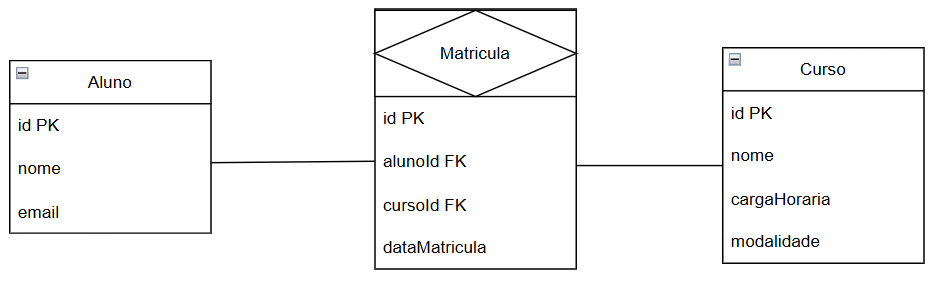
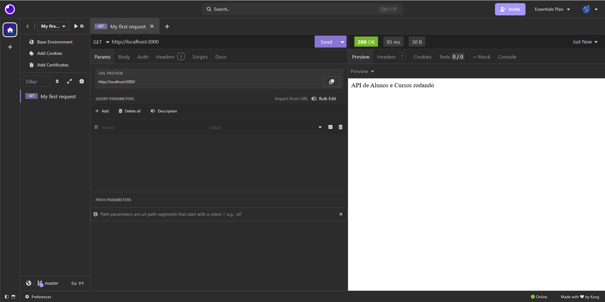
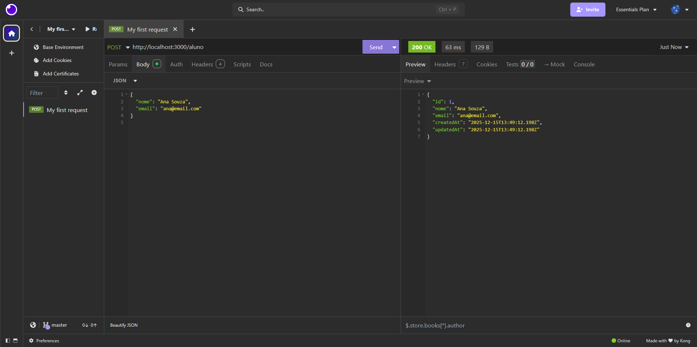
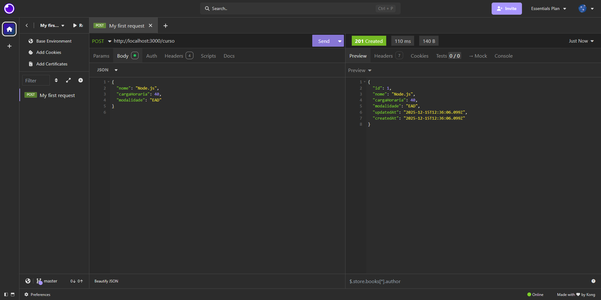
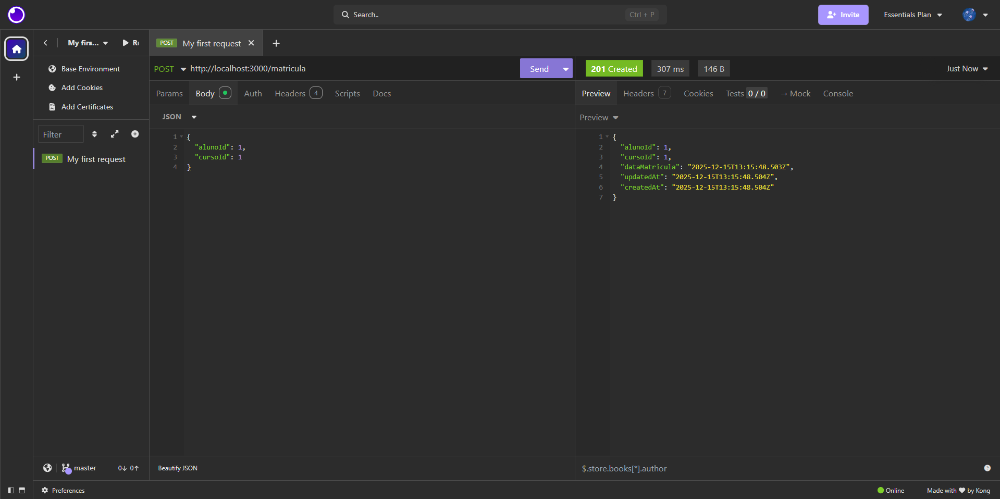
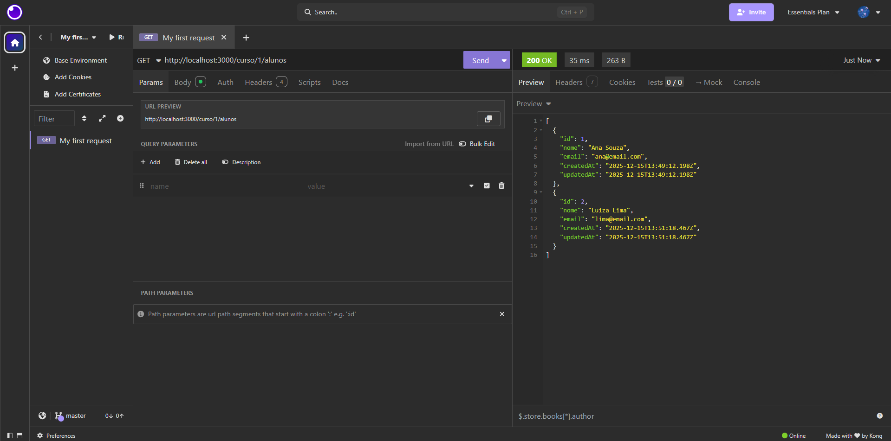
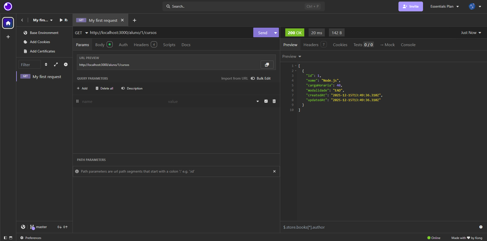
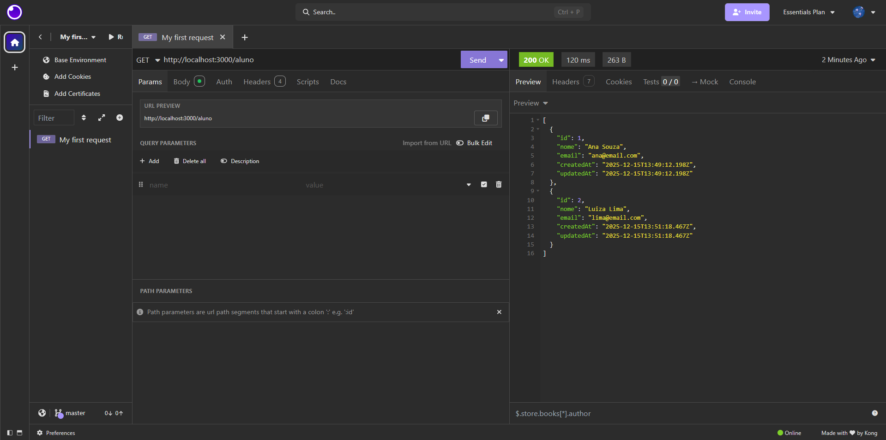

## MODELO DER


## INSTALAR AS DEPENDENCIAS
- Dependenciais principais: ``` npm install express sequelize sqlite3```

- Dependenciais de desenvolvimento: ```npm install --save-dev sequelize-cli nodemon```

- Configurar Sequelize CLI: ```npx sequelize-cli init```

## RODAR AS MIGRATIONS
- Executa o comando: ```npx sequelize-cli db:migrate```

## INICIAR A APLICAÇÃO
- Inicia o servidor: ```node src/server.js```

## PRINCIPAIS ENDPOINTS
### Alunos
````
+--------+----------------------+-----------------------------+
| Método | Endpoint	            | Descrição                   |
+--------+----------------------+-----------------------------+
|GET	 | /alunos	            | Lista todos os alunos       |
|GET	 | /alunos/:id	        | Detalha um aluno específico |
|POST	 | /alunos	            | Cria um novo aluno          |
|PUT	 | /alunos/:id	        | Atualiza dados de um aluno  |
|DELETE	 | /alunos/:id	        | Remove um aluno             |
|GET	 | /alunos/:id/cursos	|Lista os cursos do aluno     |
+--------+----------------------+-----------------------------+
````

### Cursos
````
+--------+----------------------+-----------------------------+
| Método | Endpoint	            | Descrição                   |
+--------+----------------------+-----------------------------+
|GET	 | /cursos	            | Lista todos os cursos       |
|GET	 | /cursos/:id          | Detalha um curso específico |
|POST	 | /cursos	            | Cria um novo curso          |
|PUT	 | /cursos/:id	        | Atualiza dados de um curso  |
|DELETE	 | /cursos/:id	        | Remove um curso             |
|GET	 | /cursos/:id/alunos	| Lista os alunos do curso     |
+--------+----------------------+-----------------------------+
````

### Matriculas
````
+--------+----------------------+-----------------------------+
| Método | Endpoint	            | Descrição                   |
+--------+----------------------+-----------------------------+
|POST    | /matriculas          | Cria uma matrícula          |
+--------+----------------------+-----------------------------+
````

## ROTA BÁSICA


## TESTES
### Criação de aluno


### Criação de curso


### Criação de matricula


### Consulta aos cursos de um aluno
Tem dois alunos no curso de ID 1


### Consulta aos alunos de umm curso
O aluno de ID 1 está matriculado em um curso


### Todos os alunos


### Todos os cursos
